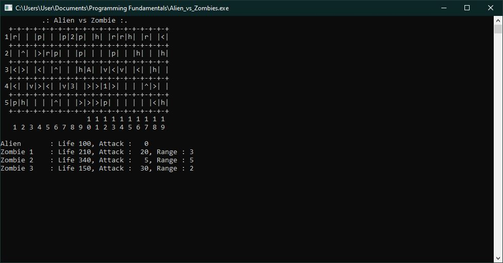

# Alien vs. Zombie

Alien vs. Zombie is a turn-based text game where the player navigates as an Alien on a path to destroy zombies. This game combines elements of
role-playing game, puzzle path-planning and strategy. Prior to the game, players can set their own settings which includes game board dimensions 
and number of zombies. The player can also save and load their game using savefiles.



[Video Demo](https://youtu.be/vMUVKV-I2E0).

## Compilation Instructions

1. Download and install a compiler.
2. Extract files if in .zip.
3. Open the command line and change directory to the particular one where the source file is stored, using cd like so:

```
cd C:\file\...
```
3. To compile, type in the command prompt:

```
g++ main.cpp -o outputfilename.exe
```
4. To run the code, type:
```
outputfile.exe
```

## User Manual

1. Game will start with a the default board settings screen. You can choose to change the settings by inputting 'y' when prompt.
2. On the game settings screen, you can specify the gameboard's dimensions and the number of zombies.
3. Then, a game screen will show, displaying the gameboard with the characters, obstacles and power-ups.
4. Commands you can do to control the Alien are 'up', 'down', 'left', and 'right'
5. To end the program, you can type 'exit' or close the application window.

## Progress Log

- [Part 1](PART1.md)
- [Part 2](PART2.md)

## Contributors

- Muhamad Syamil Imran bin Mohd Mansor
- Muhammad Ammar Ajwad


